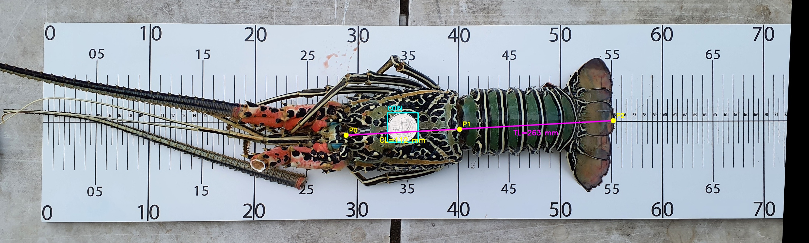
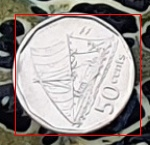

# Lobster Measurement Pipeline

Automated lobster morphometric measurement system based on computer vision, calibration board detection, coin-based size validation, and YOLO object detection.

The script processes photographs of lobsters positioned on a calibrated measurement board and automatically:

1. Detects and calibrates the measurement board.
2. Corrects image perspective using homography.
3. Detects a reference coin.
4. Detects lobster anatomical landmarks.
5. Calculates carapace length and total length.
6. Produces calibrated images with measurement overlays.
7. Generates JSON output suitable for fisheries databases and monitoring systems.

---

## Features

### Calibration Board Processing

The system uses a custom ruler board containing 14 calibration markers.

| Marker | Position |
|---|---|
| T10-T70 | Top row |
| B10-B70 | Bottom row |

The calibration workflow:

1. Detects board landmarks using YOLO.
2. Tests all four image orientations.
3. Selects the orientation with the most valid calibration points.
4. Performs iterative homography refinement.
5. Rejects calibrations with excessive residual error.
6. Generates a perspective-corrected board image.

### Coin Detection

A coin may be used as a secondary validation reference.

The system:

- Detects the coin using a dedicated YOLO model.
- Validates circularity using the bounding-box width-to-height ratio.
- Estimates a size-correction factor from the known coin diameter.
- Optionally extracts and saves a cropped coin image.
- Records the coin confidence, bounding box, apparent dimensions, and correction factor in JSON.

### Lobster Measurement

The lobster model detects three landmarks:

| Landmark | Description |
|---|---|
| P0 | Head reference point |
| P1 | End of carapace |
| P2 | Tail tip |

#### Carapace Length (CL)

Distance:

```text
P0 -> P1
```

Formula:

```python
CL = distance(P0, P1) / MEASUREMENT_ZOOM_FACTOR
```

#### Total Length (TL)

Distance:

```text
P0 -> P2
```

Formula:

```python
TL = distance(P0, P2) / MEASUREMENT_ZOOM_FACTOR
```

If a valid coin is detected, coin-corrected measurements are also produced:

```text
CoinBasedCarapaceLengthMm
CoinBasedTotalLengthMm
```

---

## Processing Pipeline

```text
Input JPG
    |
    v
Four Rotation Candidates
    |
    v
Board Marker Detection
    |
    v
Best Orientation Selection
    |
    v
Iterative Perspective Calibration
    |
    v
Calibrated Board Image
    |
    +--> Coin Detection and Optional Extraction
    |
    +--> Lobster Landmark Detection
    |
    v
Length Calculation
    |
    v
Annotated Image and JSON Output
```

---

## Requirements

### Python

Python 3.10 or later is recommended because the script uses modern type hints such as `list[str]` and union types using `|`.

### Python Packages

```bash
pip install opencv-python numpy pillow
```

> **GPU note:** The standard `opencv-python` package normally provides CPU execution. CUDA acceleration requires an OpenCV build compiled with CUDA and the DNN CUDA backend.

---

## Configuration Constants

```python
CALIBRATION_ZOOM_FACTOR = 1.0
MEASUREMENT_ZOOM_FACTOR = 4.0
EXPORT_SCALE = 2
BOARD_WIDTH = 1590
BOARD_HEIGHT = 380
CALIBRATION_BORDER = 200
DESTINATION_BORDER_Y = 50
```

| Constant | Description |
|---|---|
| `CALIBRATION_ZOOM_FACTOR` | Scaling factor used during iterative calibration |
| `MEASUREMENT_ZOOM_FACTOR` | Divisor used to convert detected pixel distances into millimetres |
| `EXPORT_SCALE` | Resolution multiplier applied while producing calibrated images |
| `BOARD_WIDTH` | Nominal measurement-board width |
| `BOARD_HEIGHT` | Nominal measurement-board height |
| `CALIBRATION_BORDER` | Border added around the calibration destination |
| `DESTINATION_BORDER_Y` | Vertical margin retained in the final calibrated image |

With the supplied values, the intended calibrated output dimensions are:

```text
Width  = BOARD_WIDTH * EXPORT_SCALE = 3180 pixels
Height = (BOARD_HEIGHT + 2 * DESTINATION_BORDER_Y) * EXPORT_SCALE = 960 pixels
```

---

## Required YOLO Models

The application loads three YOLOv4 detectors.

### Board Calibration Model

```text
yolov4-rulerplus.cfg
yolov4-rulerplus_last.weights
rulerplus.names
```

Purpose: detect calibration-board markers.

### Coin Detection Model

```text
yolov4-coin.cfg
yolov4-coin_final.weights
coin.names
```

Purpose: detect the reference coin.

### Lobster Landmark Model

```text
yolov4-lobster_lengths.cfg
yolov4-lobster_lengths_last.weights
lobster_lengths.names
```

Purpose: detect the `p0`, `p1`, and `p2` landmarks.

### Model Search Paths

For each required model file, the script searches:

```text
<models_root>/
<models_root>/configs/
<models_root>/models/
<models_root>/names/
<models_root>/cfg/
<models_root>/weights/
```

A possible directory structure is:

```text
project/
|-- measure_lobster.py
|-- models/
|   |-- cfg/
|   |   |-- yolov4-rulerplus.cfg
|   |   |-- yolov4-coin.cfg
|   |   `-- yolov4-lobster_lengths.cfg
|   |-- weights/
|   |   |-- yolov4-rulerplus_last.weights
|   |   |-- yolov4-coin_final.weights
|   |   `-- yolov4-lobster_lengths_last.weights
|   `-- names/
|       |-- rulerplus.names
|       |-- coin.names
|       `-- lobster_lengths.names
|-- images/
|-- calibrated/
|-- json/
`-- coins/
```

---

## Command-Line Usage

```text
python measure_lobster.py <inputJpgOrFolder> <calibratedOutputFolder> <jsonOutputFolder> [options]
```

### Positional Arguments

| Argument | Description |
|---|---|
| `inputJpgOrFolder` | A single `.jpg`/`.jpeg` file or a folder containing JPEG images |
| `calibratedOutputFolder` | Destination folder for calibrated and annotated images |
| `jsonOutputFolder` | Destination folder for per-image JSON results |

### Optional Arguments

| Option | Default | Description |
|---|---:|---|
| `--models <folder>` | Script directory | Root folder containing YOLO model files |
| `--coinDiameterMm <value>` | `24.0` | Known coin diameter in millimetres |
| `--gpu <index>` | `0` | CUDA device index when CUDA is available |
| `--coinOutputFolder <folder>` | None | Optional destination for extracted coin images |

### Process a Single Image

```bash
python measure_lobster.py lobster.jpg calibrated json
```

### Process a Folder

```bash
python measure_lobster.py images calibrated json
```

### Full Example

```bash
python measure_lobster.py images calibrated json \
  --models models \
  --coinDiameterMm 24.0 \
  --gpu 0 \
  --coinOutputFolder coins
```

### Windows PowerShell Example

```powershell
python .\measure_lobster.py `
  .\images `
  .\calibrated `
  .\json `
  --models .\models `
  --coinDiameterMm 24.0 `
  --gpu 0 `
  --coinOutputFolder .\coins
```

---

## Outputs

### Calibrated and Annotated Image

For an input named `IMG_0001.jpg`, the script creates:

```text
calibrated/IMG_0001.jpg
```

The image may contain:

- A cyan coin bounding box and `COIN` label.
- Yellow/cyan `P0`, `P1`, and `P2` markers.
- A yellow/cyan line from `P0` to `P1` for carapace length.
- A magenta line from `P0` to `P2` for total length.
- `CL` and `TL` measurement labels.



### Extracted Coin Image

When `--coinOutputFolder` is supplied:

```text
coins/IMG_0001.jpg
```

The extracted image contains a crop around the detected coin with a red rectangle marking its bounding box.



### JSON Result

The JSON output uses the input stem:

```text
json/IMG_0001.json
```

Fields are converted from Python snake_case to PascalCase.

Example structure:

```json
{
  "InputFile": "images/IMG_0001.jpg",
  "CalibratedImageFile": "calibrated/IMG_0001.jpg",
  "Calibration": {
    "Success": true,
    "Message": "Calibration succeeded",
    "Orientation": "Straight",
    "Step": 2,
    "Residual": 12.4,
    "ZoomFactor": 1.0,
    "CalibrationBorder": 200,
    "DestinationBorderY": 50,
    "OutputWidth": 3180,
    "OutputHeight": 960,
    "DetectedPoints": []
  },
  "Coin": {
    "Detected": true,
    "Confidence": 0.98,
    "BoundingBox": {
      "X": 100,
      "Y": 200,
      "Width": 96,
      "Height": 94
    },
    "CoinBoundingBoxWidthMm": 24.0,
    "CoinBoundingBoxHeightMm": 23.5,
    "CoinBasedSizeCorrection": 1.0,
    "ExtractedCoinFile": "coins/IMG_0001.jpg"
  },
  "Lobster": {
    "Detected": true,
    "CarapaceLengthMm": 112.0,
    "TotalLengthMm": 268.0,
    "CoinBasedCarapaceLengthMm": 112.0,
    "CoinBasedTotalLengthMm": 268.0,
    "CoinCorrectionFactor": 1.0,
    "P0": {
      "X": 500.0,
      "Y": 420.0,
      "Confidence": 0.97
    },
    "P1": {
      "X": 948.0,
      "Y": 420.0,
      "Confidence": 0.96
    },
    "P2": {
      "X": 1572.0,
      "Y": 425.0,
      "Confidence": 0.95
    }
  },
  "Warnings": [],
  "Error": null
}
```

The values above are illustrative. Actual values depend on image content and model detections.

---

## Calibration Logic

The calibration process:

1. Creates temporary copies at 0, 90, 180, and 270-degree orientations.
2. Runs the ruler-marker detector on every rotation.
3. Filters marker candidates into aligned top and bottom rows.
4. Selects the rotation with the largest number of accepted markers.
5. Computes a homography from detected image coordinates to known board coordinates.
6. Warps the image at `EXPORT_SCALE` resolution.
7. Re-detects markers and repeats calibration while the residual improves.
8. Selects the calibration step with the lowest residual.
9. Rejects the result if the best residual is `100` or higher.
10. Crops and saves the calibrated board image.

At least four valid calibration points are required to estimate the homography.

---

## Coin Validation and Correction

The highest-confidence coin detection is selected. It is rejected when its bounding-box aspect ratio is greater than `1.2`.

The apparent coin dimensions are calculated as:

```python
coin_width_mm = bounding_box_width / MEASUREMENT_ZOOM_FACTOR
coin_height_mm = bounding_box_height / MEASUREMENT_ZOOM_FACTOR
```

The correction factor is based on bounding-box width:

```python
correction_factor = known_coin_diameter_mm / coin_width_mm
```

Corrected lobster measurements are then calculated as:

```python
corrected_cl = measured_cl * correction_factor
corrected_tl = measured_tl * correction_factor
```

---

## GPU and CPU Execution

If `cv2.cuda.getCudaEnabledDeviceCount()` reports one or more CUDA devices, the script configures the OpenCV DNN module to use:

```python
cv2.dnn.DNN_BACKEND_CUDA
cv2.dnn.DNN_TARGET_CUDA
```

Otherwise, it falls back to:

```python
cv2.dnn.DNN_BACKEND_OPENCV
cv2.dnn.DNN_TARGET_CPU
```

The `--gpu` argument selects the CUDA device when a non-negative index is supplied.

---

## Exit Codes

| Code | Meaning |
|---:|---|
| `0` | Processing loop completed |
| `1` | Required command-line arguments were not supplied |
| `2` | Input did not contain supported JPEG files |
| `99` | Fatal unhandled error during application startup or execution |

A per-image processing error does not stop the batch. The error is written to that image's JSON result and processing continues with the next image.

---

## Limitations and Operational Notes

- Only `.jpg` and `.jpeg` input files are processed.
- Folder scanning is not recursive.
- File processing order depends on the directory iteration order.
- Detection thresholds are fixed at `0.25` confidence and `0.45` non-maximum suppression unless the code is changed.
- The coin correction uses the detected bounding-box width, not the average of width and height.
- Coin detection is optional for the primary board-based measurements.
- All three landmarks, `p0`, `p1`, and `p2`, must be detected before lobster measurements are produced.
- Temporary calibration images are deleted after processing where possible.
- Model files are loaded once and reused across all images in the batch.

---

## Troubleshooting

### No JPG files found to process

Check that:

- The input path exists.
- A single input file has a `.jpg` or `.jpeg` extension.
- A folder contains JPEG files directly, rather than only in subfolders.

### Model file not found

Confirm that all `.cfg`, `.weights`, and `.names` files exist under the path supplied with `--models` or one of its supported subdirectories.

### Calibration fails

Possible causes include:

- Fewer than four board markers were detected.
- Top and bottom marker rows could not be aligned reliably.
- The board is cropped or obscured.
- Perspective distortion or blur is too severe.
- The best calibration residual is `100` or higher.

### GPU is not used

The script uses CUDA only when the installed OpenCV build reports CUDA-enabled devices. Installing the standard `opencv-python` wheel alone does not generally provide an OpenCV CUDA build.

### Lobster is not measured

Verify that the landmark model detects all three required classes exactly as:

```text
p0
p1
p2
```

---

## Typical Fisheries Monitoring Workflow

```text
Field Photograph
        |
        v
measure_lobster.py
        |
        +--> Calibrated and Annotated Image
        +--> JSON Measurements
        +--> Optional Coin Crop
        |
        v
Validation and Database Import
        |
        v
Length-Frequency Analysis and Reporting
```

This pipeline supports repeatable extraction of lobster length measurements from photographs captured on a calibrated measurement board.
